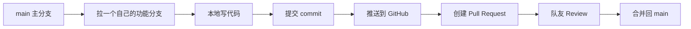
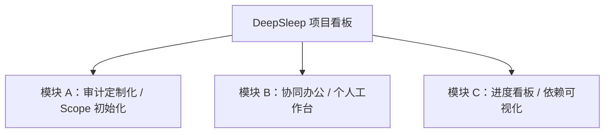
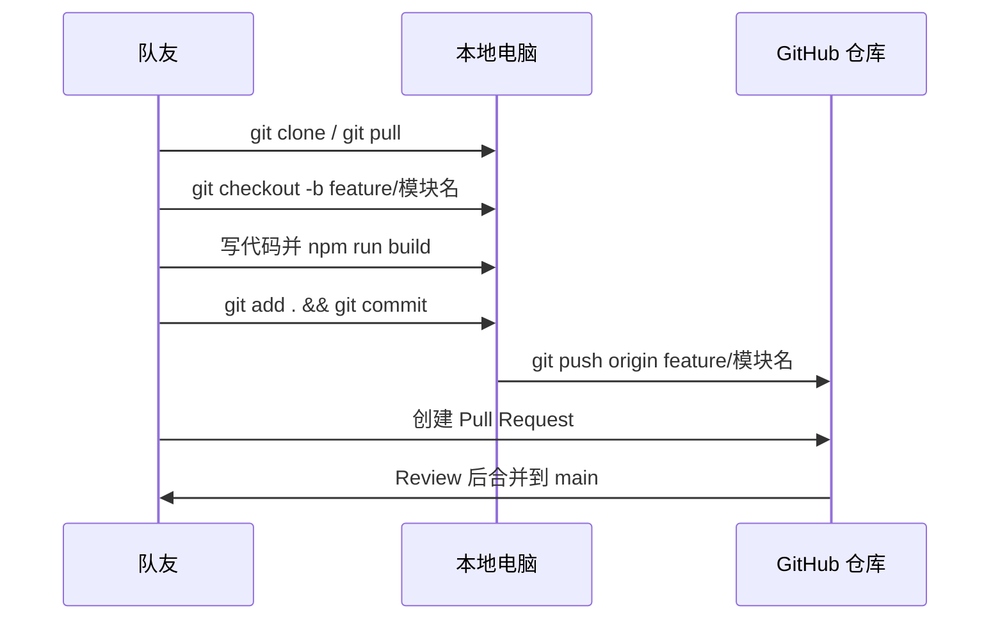

# DeepSleep 项目 GitHub 协作教程

这份文档给第一次用 GitHub 协作的队友看。大家照着步骤做，就能一起开发这个项目看板。

## 1. 项目地址和本地启动

GitHub 仓库：

```text
https://github.com/BenningCool/DeepSleep
```

第一次拿到项目：

```bash
git clone https://github.com/BenningCool/DeepSleep.git
cd DeepSleep
npm install
npm run dev
```

启动后，终端会显示一个地址，通常是：

```text
http://127.0.0.1:5173/
```

在浏览器打开这个地址，就能看到项目看板页面。

## 2. 你们要记住的协作规则

不要直接在 `main` 分支上开发。每个人做自己的功能分支，做完后在 GitHub 上开 Pull Request，大家确认没问题后再合并。



## 3. 三个模块怎么分工

建议把截图里的 3 个 P0 需求拆成 3 个模块，每个人负责一个模块。



### 模块 A：审计定制化 / Scope 初始化

建议分支：

```bash
git checkout -b feature/scope-init
```

主要任务：

- 创建项目表单
- 行业、审计领域、项目类型选择
- 根据选择自动生成初始化任务
- 关键阶段不可跳过的规则

### 模块 B：协同办公 / 个人工作台

建议分支：

```bash
git checkout -b feature/workspace
```

主要任务：

- 成员列表
- 我的任务
- 我的项目
- 成员工作负荷统计
- 按负责人聚合任务

### 模块 C：进度看板 / 依赖可视化

建议分支：

```bash
git checkout -b feature/progress-board
```

主要任务：

- 增强当前 Kanban 看板
- ITGC / ITAC 依赖关系可视化
- 阶段进度统计
- 阻塞状态和依赖提示

## 4. 每天开始写代码前

先确保自己本地代码是最新的：

```bash
git checkout main
git pull
```

然后创建自己的功能分支：

```bash
git checkout -b feature/你的功能名
```

例子：

```bash
git checkout -b feature/workspace
```

## 5. 写完代码后怎么提交

先检查改了哪些文件：

```bash
git status
```

确认页面能正常构建：

```bash
npm run build
```

把改动加入暂存区：

```bash
git add .
```

提交：

```bash
git commit -m "feat: add workspace module"
```

推送到 GitHub：

```bash
git push origin feature/你的功能名
```

例子：

```bash
git push origin feature/workspace
```

## 6. 怎么创建 Pull Request

推送后，打开 GitHub 仓库页面。GitHub 通常会显示一个按钮：

```text
Compare & pull request
```

点击后填写：

- Title：这次做了什么
- Description：改了哪些页面、怎么测试的、有没有注意事项

PR 描述可以用这个模板：

```md
## 做了什么
- 

## 怎么测试
- [ ] npm run build
- [ ] 浏览器打开页面检查交互

## 需要队友重点看
- 
```

## 7. 如果 main 更新了怎么办

如果别人先合并了代码，你自己的分支可能落后。可以这样同步：

```bash
git checkout main
git pull
git checkout feature/你的功能名
git merge main
```

如果没有冲突，继续开发就行。

如果出现冲突，先不要慌。打开冲突文件，会看到类似：

```text
<<<<<<< HEAD
你的代码
=======
别人的代码
>>>>>>> main
```

把重复或冲突的部分整理成正确版本，然后：

```bash
git add .
git commit -m "fix: resolve merge conflict"
```

## 8. 项目文件怎么看

当前主要文件：

```text
src/main.jsx       看板页面和主要交互
src/mockData.js    默认任务、看板列、样例数据
src/styles.css     页面样式
index.html         Vite 页面入口
package.json       项目依赖和启动命令
```

后续多人开发时，建议逐步拆成：

```text
src/
  components/
    Sidebar.jsx
    Topbar.jsx
    Board.jsx
    TaskCard.jsx
    TaskDrawer.jsx
  modules/
    scope-init/
    workspace/
    progress-board/
  data/
    mockData.js
  styles.css
  main.jsx
```

## 9. 常见问题

### npm install 报错

先确认安装了 Node.js。推荐安装 Node.js LTS 版本：

```text
https://nodejs.org/
```

安装完成后重新打开终端，再执行：

```bash
npm install
```

### 页面打不开

确认已经执行：

```bash
npm run dev
```

不要直接双击 `index.html`，React/Vite 项目要通过本地开发服务器打开。

### 不小心在 main 上写代码了

先创建一个新分支保存当前改动：

```bash
git checkout -b feature/临时功能名
```

然后继续提交和推送，不要直接推 main。

## 10. 推荐提交信息

常用格式：

```text
feat: add workspace module
fix: resolve card drag issue
style: polish board layout
docs: add github collaboration guide
refactor: split task drawer component
```

含义：

- `feat`：新增功能
- `fix`：修 bug
- `style`：只改样式
- `docs`：只改文档
- `refactor`：重构代码

## 11. 最小协作流程复盘


